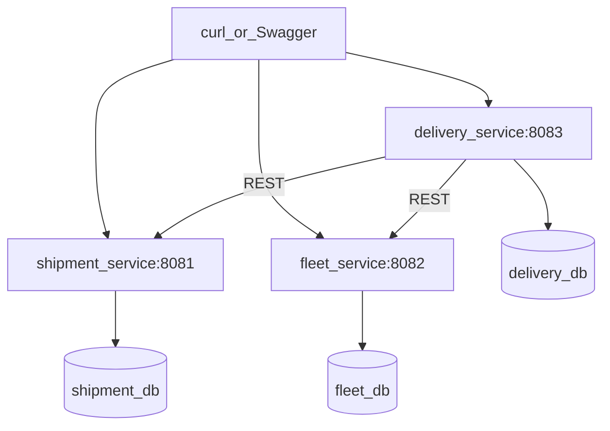

# C4 — Containers

Deployment view of the prototype.

## Responsibilities

| Container | Technology | Data |
|-----------|------------|------|
| shipment-service | Spring Boot, JPA, Flyway | Own database (`shipment`) |
| fleet-service | Spring Boot, JPA, Flyway | Own database (`fleet`) |
| delivery-service | Spring Boot, JPA, RestClient, `@Scheduled` telemetry | Own database (`delivery`) |

## Dispatch

`DispatchOrchestrator` runs in **delivery-service** (application layer). It calls shipment-service and fleet-service over HTTP to reserve a drone and update shipment status.