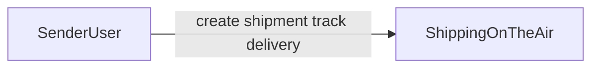

# C4 — System Context

## System

**Shipping on the Air** — drone-based package delivery: request a shipment, automatic dispatch to an available drone, track position and ETA until delivered.

## Actor

- **Sender** — creates shipments and monitors delivery (via API client: curl or Swagger in the prototype)

## Scope note

The prototype exposes HTTP APIs directly. A dedicated end-user application is out of scope for v1; tracking data is returned as JSON (coordinates and ETA).
