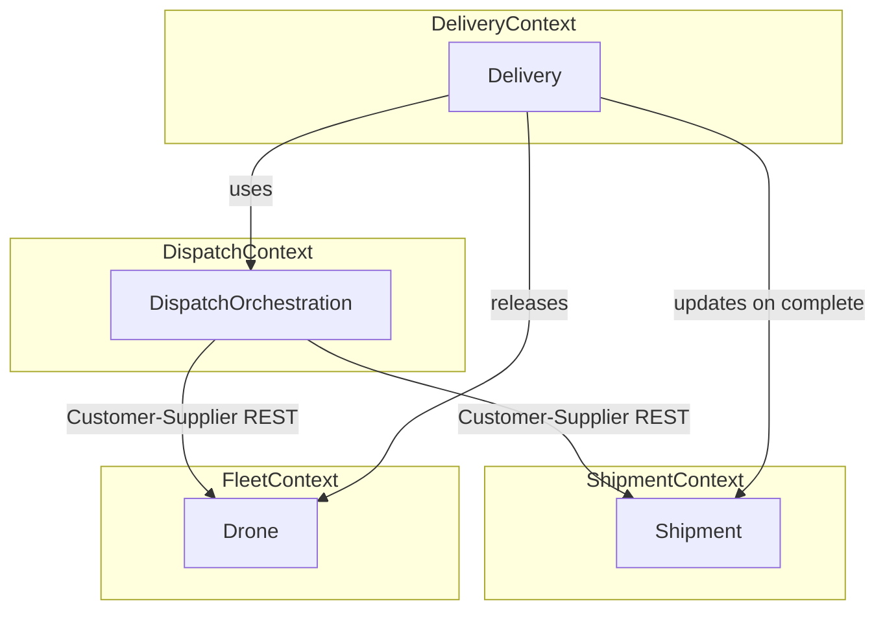

# Context Map

Bounded contexts and relationships implemented in the prototype.

## Relationships

| Upstream | Downstream | Pattern | Integration |
|----------|------------|---------|-------------|
| Shipment | Dispatch | Customer-Supplier | REST: read shipment, patch status |
| Fleet | Dispatch | Open Host Service | REST: list available, reserve, release |
| Delivery | Shipment | Customer-Supplier | REST: mark delivered / failed |
| Delivery | Fleet | Customer-Supplier | REST: release drone |

## Deployment mapping

| Context | Service |
|---------|---------|
| Shipment | shipment-service |
| Fleet | fleet-service |
| Delivery + Dispatch (application) | delivery-service |

Dispatch is a **conceptual context** implemented as application logic in delivery-service (`DispatchOrchestrator`), documented here for DDD clarity.
