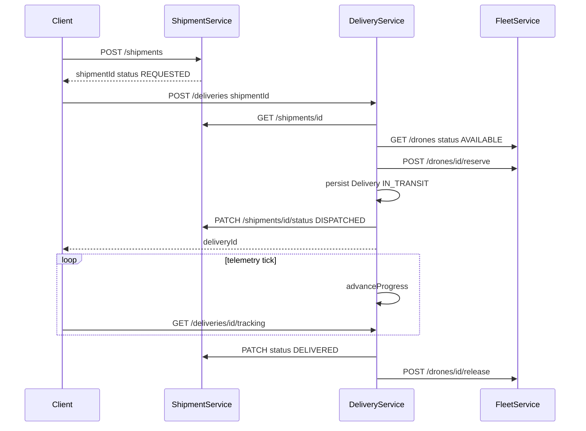

# Sequence — Start delivery (v1)

Includes dispatch orchestration inside delivery-service.

```mermaid
sequenceDiagram
  participant C as Client
  participant SH as ShipmentService
  participant DL as DeliveryService
  participant FL as FleetService

  C->>SH: POST /shipments
  SH-->>C: shipmentId status REQUESTED
  C->>DL: POST /deliveries shipmentId
  DL->>SH: GET /shipments/id
  DL->>FL: GET /drones status AVAILABLE
  DL->>FL: POST /drones/id/reserve
  DL->>DL: persist Delivery IN_TRANSIT
  DL->>SH: PATCH /shipments/id/status DISPATCHED
  DL-->>C: deliveryId
  loop telemetry tick
    DL->>DL: advanceProgress
    C->>DL: GET /deliveries/id/tracking
  end
  DL->>SH: PATCH status DELIVERED
  DL->>FL: POST /drones/id/release
```